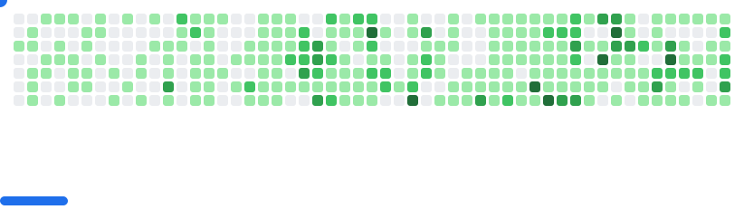

<h2 align="center">Hello  ! I'm Maifee, Maifee Ul Asad 🇧🇩</h2>

   • <a href="https://maifeeulasad.github.io/">GhPage</a> • <a href="https://maifeeulasad.github.io/resume/">Resume</a> • <a href="https://neurobangla.com/">NeuroBangla</a> •

 • 🇧🇩-🇧🇩🇧🇩🇧🇩🇧🇩🇧🇩🇧🇩🇧🇩🇧🇩🇧🇩-🇧🇩🇧🇩🇧🇩🇧🇩🇧🇩🇧🇩🇧🇩-🇧🇩 •

<picture>
  <source
    media="(prefers-color-scheme: dark)"
    srcset="images/breakout-dark.svg"
  />
  <source
    media="(prefers-color-scheme: light)"
    srcset="images/breakout-light.svg"
  />
  
</picture>

If you have made this far, I will make an wild guess - you already know me, right? But, what if you don't.

I'm not who I'm, I'm what I'm. And these "what"s changes from time to time, dynamic. So I will give you links only.

### Things I'm familiar with

<!--  -->

<table>
  <thead>
    <tr>
      <th colspan="2">Android</th>
    </tr>
  </thead>
  <tbody>
    <tr>
      <td>
         +
         +
        
      </td>
      <td><a href="https://github.com/maifeeulasad/Geneder-Prediction-Name-Android">Name Gender Classification</a></td>
    </tr>
    <tr>
      <td>
         +
         +
        
      </td>
      <td>
        <a href="https://github.com/maifeeulasad/Backup-by-Maifee">Backup System</a> 
        <a href="https://github.com/maifeeulasad/SDAS">Smartphone based Digital Attendance System</a> 
        <a href="https://github.com/maifeeulasad/Overwatch">Activity monitor</a> 
        <a href="https://github.com/maifeeulasad/MLauncher">Yet another launcher</a> 
        <a href="https://github.com/maifeeulasad/Chirkut">Peer to Peer chat</a> 
        <a href="https://github.com/maifeeulasad/unmukto">Android Keyboard (Bengali)</a> 
        <a href="https://github.com/maifeeulasad/android-volume-service">Volume Service</a> 
        <a href="https://github.com/maifeeulasad/CU-nostalgic-wallpaper">Wallpaper Mananger (for CU)</a> 
        <a href="https://github.com/maifeeulasad/Word-Puzzle-Solver-Suggestions">Word Puzzle Solver Suggestion</a> 
        <a href="https://github.com/maifeeulasad/notification-logger-android">Notification Logger</a> 
        <a href="https://github.com/maifeeulasad/CSE516-CShare">Online File(Study Material) Sharing</a> 
        <a href="https://github.com/maifeeulasad/prayer-tracker-islamic">Islamic Prayer Tracker</a> 
        <a href="https://github.com/maifeeulasad/Book-Manager">Book Manager</a> 
        <a href="https://github.com/maifeeulasad/WhatApp">WhatsApp Clone</a>
      </td>
    </tr>
    <tr>
      <td>
         +
        
      </td>
      <td><a href="https://github.com/maifeeulasad/Free-Cart-Client">Shopping cart client</a></td>
    </tr>
  </tbody>
  <thead>
    <tr>
      <th colspan="2">Chrome Browser / Brave Browser / Chromium based Extension</th>
    </tr>
  </thead>

  <tbody>
    <tr>
      <td>
         + 
      </td>
      <td>
      <a href="https://github.com/maifeeulasad/Chrome-SaveAndSleep">Extension to save and reload all pages</a> 
      <a href="https://github.com/maifeeulasad/chrome-mua-tab">Replace default new-page image</a> 
      <a href="https://github.com/maifeeulasad/Night-Mode-Chrome">Dark Mode</a> 
      <a href="https://github.com/maifeeulasad/chrome-sfw">Safe Environment Extension</a>
      </td>
    </tr>
  </tbody>

  <thead>
    <tr>
      <th colspan="2">Artificial Intelligence / Machine Learning</th>
    </tr>
  </thead>

  <tbody>
    <tr>
      <td>
         + 
        
      </td>
      <td>
        <a href="https://github.com/maifeeulasad/gedit-localllama">AI in gedit (Local LLM)</a> 
        <a href="https://github.com/maifeeulasad/local-search">LLM enabled local search</a> 
        <a href="https://github.com/maifeeulasad/LocalLLaMA">LocalLLaMA Archive</a> 
        <a href="https://github.com/maifeeulasad/Mobile-OMR">Mobile OMR (Computer Vision)</a> 
        <a href="https://github.com/maifeeulasad/Anti-Sexual-Assault-App">Environment Tension Analysis</a> 
      </td>
    </tr>
  </tbody>

  <thead>
    <tr>
      <th colspan="2">Compiler Construction (Lexer, Parser, IR)</th>
    </tr>
  </thead>

  <tbody>
    <tr>
      <td>
         + 
      </td>
      <td>
      <a href="https://github.com/maifeeulasad/guishap">Guishap(A Bengali programming language)</a>
      </td>
    </tr>
    <tr>
      <td>
         + 
      </td>
      <td>
      <a href="https://github.com/maifeeulasad/JSON2MUAON">A custom parser `(JSON->x)`</a> 
      <a href="https://github.com/maifeeulasad/MUAON2JSON">Another custom parser `(x->JSON)`</a> 
      </td>
    </tr>
  </tbody>

  <thead>
    <tr>
      <th colspan="2">Embedded Programming / Robotics</th>
    </tr>
  </thead>

  <tbody>
    <tr>
      <td>
        
      </td>
      <td>
      <a href="https://github.com/maifeeulasad/AVR-calculator">AVR calculator</a>
      </td>
    </tr>
    <tr>
      <td>
        
      </td>
      <td>
      <a href="https://github.com/maifeeulasad/obstacle_avoiding_robot">Obstacle Avoiding Robot</a> 
      <a href="https://github.com/maifeeulasad/Arduino-Clock">LCD Clock</a> 
      <a href="https://github.com/maifeeulasad/Arduino-Seven-Segment">Seven Segment Library</a> 
      <a href="https://github.com/maifeeulasad/Mouse-with-arduino-and-python">Mouse Control with Arduino</a> 
      <a href="https://github.com/maifeeulasad/Mouse-3D">3D Mouse (move some object in Unity3D)</a> 
      <a href="https://github.com/maifeeulasad/Arduino-Hand-Sanitizer">Automated Hand Sanitizer</a> 
      </td>
    </tr>
  </tbody>

  <thead>
    <tr>
      <th colspan="2">Package Management/Publishing</th>
    </tr>
  </thead>

  <tbody>
    <tr>
      <td>
        
      </td>
      <td>
      <a href="https://www.npmjs.com/~maifeeulasad">Packages published in NPM</a> 
      <a href="https://github.com/maifeeulasad/to-spreadsheet">Spreadsheet Creation Package</a> 
      <a href="https://github.com/maifeeulasad/node-thumbnail-generator">Thumbnail Generator</a> 
      <a href="https://github.com/maifeeulasad/ctrlc-node-pid">Process Control by PID</a> 
      <a href="https://github.com/maifeeulasad/codeforces-api-node">Codeforces API Wrapper</a> 
      <a href="https://github.com/maifeeulasad/os-check">OS Detection Library</a>
      </td>
    </tr>
    <tr>
      <td>
        
      </td>
      <td>
      <a href="https://pypi.org/user/maifeeulasad/">Packages published in PyPi</a> 
      </td>
    </tr>
    <tr>
      <td>
        
      </td>
      <td>
      <a href="https://hub.docker.com/u/maifeeulasad">Packages published in Docker</a> 
      <a href="https://github.com/maifeeulasad/docker-compose-collection">Docker Compose Collection</a> 
      <a href="https://github.com/maifeeulasad/opencv-alpine">OpenCV Alpine Image</a> 
      <a href="https://github.com/maifeeulasad/node-fileutils">File Utilities Image</a>
      </td>
    </tr>
  </tbody>

  <thead>
    <tr>
      <th colspan="2">Web</th>
    </tr>
  </thead>
  <tbody>
    <tr>
      <td>
        
      </td>
      <td>
        <a href="https://github.com/maifeeulasad/react-mua-create-library">Library Template</a> 
        <a href="https://github.com/maifeeulasad/react-mua-geo-heatmap">Geo Heatmap</a> 
        <a href="https://github.com/maifeeulasad/react-mua-error">Error Page Library</a> 
        <a href="https://github.com/maifeeulasad/react-mua-signup">Signup Library</a> 
        <a href="https://github.com/maifeeulasad/react-mua-login">Login Library</a> 
        <a href="https://github.com/maifeeulasad/react-mua-map">Map Library</a> 
        <a href="https://github.com/maifeeulasad/react-mua-geo-heatmap">Geo Heat-Map Library</a>
      </td>
    </tr>
    <tr>
      <td>
         +
        
      </td>
      <td>
        <a href="https://github.com/maifeeulasad/react-mua-gallery">Gallery Library</a> 
        <a href="https://github.com/maifeeulasad/Messenger-meme">Messenger like meme making</a>
      </td>
    </tr>
    <tr>
      <td>
         +
        
      </td>
      <td>
        <a href="https://github.com/maifeeulasad/news-update">A news application</a>
      </td>
    </tr>
    <tr>
      <td>
         +
         +
         +
         +
         +
         +
         +
         +
         +
        
      </td>
      <td></td>
    </tr>
  </tbody>
  <table>
  <thead>
    <tr>
      <th colspan="2">Web</th>
    </tr>
  </thead>
  <tbody>
    <tr>
      <td>
        
      </td>
      <td>
        <a href="https://github.com/maifeeulasad/react-mua-create-library">Library Template</a> 
        <a href="https://github.com/maifeeulasad/react-mua-geo-heatmap">Geo Heatmap</a> 
        <a href="https://github.com/maifeeulasad/react-mua-error">Error Page Library</a> 
        <a href="https://github.com/maifeeulasad/react-mua-signup">Signup Library</a> 
        <a href="https://github.com/maifeeulasad/react-mua-login">Login Library</a> 
        <a href="https://github.com/maifeeulasad/react-mua-map">Map Library</a> 
        <a href="https://github.com/maifeeulasad/react-mua-geo-heatmap">Geo Heat-Map Library</a>
      </td>
    </tr>
    <tr>
      <td>
         +
        
      </td>
      <td>
        <a href="https://github.com/maifeeulasad/react-mua-gallery">Gallery Library</a> 
        <a href="https://github.com/maifeeulasad/Messenger-meme">Messenger like meme making</a>
        <a href="https://github.com/maifeeulasad/stance-analyzer-fe">Stance Analyzer Frontend</a>
      </td>
    </tr>
    <tr>
      <td>
         +
        
      </td>
      <td>
        <a href="https://github.com/maifeeulasad/news-update">A news application</a>
      </td>
    </tr>
    <tr>
      <td>
         +
         +
         +
         +
         +
         +
         +
         +
         +
        
      </td>
      <td></td>
    </tr>
  </tbody>

  <thead>
    <tr>
      <th colspan="2">Back-end</th>
    </tr>
  </thead>
  <tbody>
    <tr>
      <td>
         +
         +
        
      </td>
      <td>
        <a href="https://github.com/maifeeulasad/Backup-by-Maifee-Server">Backup by Maifee Server</a> 
        <a href="https://github.com/maifeeulasad/SDAS-heroku/">SDAS Server</a> 
        <a href="https://github.com/maifeeulasad/j-minidb">Java In-Memory Database</a>
      </td>
    </tr>
    <tr>
      <td>
         +
        
      </td>
      <td>
        <a href="https://github.com/maifeeulasad/Local-File-Server">Local File Server</a> 
        <a href="https://github.com/maifeeulasad/proxy-server">Proxy Server</a> 
        <a href="https://github.com/maifeeulasad/cpp-file-server">C++ File Server</a> 
        <a href="https://github.com/maifeeulasad/nestjs-nextjs">NestJS + NextJS App</a>
      </td>
    </tr>
    <tr>
      <td>
         +
        
      </td>
      <td>
        <a href="https://github.com/maifeeulasad/drf-inventory-management">DRF Inventory Management</a>
      </td>
    </tr>
    <tr>
      <td>
         +
         +
         +
        
      </td>
      <td></td>
    </tr>
  </tbody>

  <thead>
    <tr>
      <th colspan="2">Game Development</th>
    </tr>
  </thead>
  <tbody>
    <tr>
      <td>
        
      </td>
      <td>
        <a href="https://github.com/maifeeulasad/Mazy-Ball">Mazy ball</a> 
        <a href="https://github.com/maifeeulasad/Mouse-3D">A 3D mouse</a> 
        <a href="https://github.com/maifeeulasad/Slicer2D-Unity">Pickup loading game</a> 
        <a href="https://github.com/maifeeulasad/MUA-terrain-unity3d">Random 3D terrain</a> 
        <a href="https://github.com/maifeeulasad/Jumping-Jampak">A programmer running</a> 
        <a href="https://github.com/maifeeulasad/Rapid-Roll">Rapid Roll Game</a> 
        <a href="https://github.com/maifeeulasad/Snake-Unity2D">Snake Game</a> 
        <a href="https://github.com/maifeeulasad/Simple-Shooter">Simple Shooter</a> 
        <a href="https://github.com/maifeeulasad/Unity3d-Trail">Unity Trail Effects</a> 
        <a href="https://github.com/maifeeulasad/Unity-Dynamic-Prefab">Dynamic Prefab System</a>
      </td>
    </tr>
    <tr>
      <td>
         +
        
      </td>
      <td>
        <a href="https://github.com/maifeeulasad/TRex-Runner">T-Rex Runner (Chrome Dino)</a>
      </td>
      </td>
    </tr>
    <tr>
      <td>
         +
         +
        
      </td>
      <td></td>
    </tr>
    <tr>
      <td>
         +
        
      </td>
      <td>
        <a href="https://github.com/maifeeulasad/tic_tac_toe">Tic Tac Toe</a> 
        <a href="https://github.com/maifeeulasad/give_cheese_to_mouse">Give mouse a cheese (Maze solving)</a>
      </td>
    </tr>
  </tbody>
  <thead>
    <tr>
      <th colspan="2">Type Setting</th>
    </tr>
  </thead>
  <tbody>
    <tr>
      <td>
         +
         +
        
      </td>
      <td></td>
    </tr>
  </tbody>

  <thead>
    <tr>
      <th colspan="2">Desktop Application</th>
    </tr>
  </thead>
  <tbody>
    <tr>
      <td>
         +
         +
        
      </td>
      <td></td>
    </tr>
    <tr>
      <td>
         +
        
      </td>
      <td>
        <a href="https://github.com/maifeeulasad/MLogger-.Net">Desktop Logger</a> 
        <a href="https://github.com/maifeeulasad/Mr-Current">Battery Monitor</a> 
        <a href="https://github.com/maifeeulasad/SIGINT-APP">Process Control Library</a> 
        <a href="https://github.com/maifeeulasad/Duplicate-File-Finder-Console">Duplicate File Finder</a> 
        <a href="https://github.com/maifeeulasad/Submarine-Screen-Lock">Screen Lock Utility</a>
      </td>
    </tr>
    <tr>
      <td>
         +
         +
         +
        
      </td>
      <td>
        <a href="https://github.com/maifeeulasad/Plain-Editor">More than a text editor</a> 
        <a href="https://github.com/maifeeulasad/Enigma-Emulator">Enigma Encryptor/Decryptor</a> 
        <a href="https://github.com/maifeeulasad/Joss-Paint">Image Editor</a> 
        <a href="https://github.com/maifeeulasad/Joss-Viewer">File Viewer</a> 
        <a href="https://github.com/maifeeulasad/Desktop-File-Organizer">File Organizer</a>
      </td>
    </tr>
    <tr>
      <td>
        
      </td>
      <td>
        <a href="https://github.com/maifeeulasad/open-code-electron">Code Editor</a> 
        <a href="https://github.com/maifeeulasad/Cream">Screen Recorder</a> 
        <a href="https://github.com/maifeeulasad/Screen-Recorder">Another Screen Recorder</a> 
        <a href="https://github.com/maifeeulasad/DesktopScreenRecorder">Desktop Recorder</a>
      </td>
    </tr>
  </tbody>

  <thead>
    <tr>
      <th colspan="2">Database</th>
    </tr>
  </thead>
  <tbody>
    <tr>
      <td>
         +
         +
         +
         +
         +
        
      </td>
      <td>
        <a href="https://github.com/maifeeulasad/unified-db">Unified Database Interface</a> 
        <a href="https://github.com/maifeeulasad/j-minidb">Java In-Memory Database</a>
      </td>
    </tr>
  </tbody>

  <thead>
    <tr>
      <th colspan="2">Utilities & Tools</th>
    </tr>
  </thead>
  <tbody>
    <tr>
      <td>
        
      </td>
      <td>
        <a href="https://github.com/maifeeulasad/ytdl-mua">YouTube Downloader</a> 
        <a href="https://github.com/maifeeulasad/Image-Scrapper-Python">Image Scraper</a> 
        <a href="https://github.com/maifeeulasad/Google-Image-Downloader">Google Image Downloader</a> 
        <a href="https://github.com/maifeeulasad/OSM-feature-extract-python">OSM Feature Extractor</a> 
        <a href="https://github.com/maifeeulasad/Local-Crawler">Local File Crawler</a> 
        <a href="https://github.com/maifeeulasad/Subtitle-Maker">Subtitle Creator</a> 
        <a href="https://github.com/maifeeulasad/sof-jobs-scraper">Stack Overflow Jobs Scraper</a> 
        <a href="https://github.com/maifeeulasad/scrape-twitter">Twitter Scraper</a> 
        <a href="https://github.com/maifeeulasad/better-soup">Better BeautifulSoup</a> 
        <a href="https://github.com/maifeeulasad/mtree">Better Tree Command</a>
      </td>
    </tr>
    <tr>
      <td>
        
      </td>
      <td>
        <a href="https://github.com/maifeeulasad/gitswitch">Git Branch Switcher</a>
      </td>
    </tr>
    <tr>
      <td>
        
      </td>
      <td>
        <a href="https://github.com/maifeeulasad/nvidia-smi-java">NVIDIA SMI Java Interface</a> 
        <a href="https://github.com/maifeeulasad/delete_a_file">Force File Delete Utility</a> 
        <a href="https://github.com/maifeeulasad/Process-Tapping">Process Monitor</a>
      </td>
    </tr>
  </tbody>

  <thead>
    <tr>
      <th colspan="2">Machine Learning</th>
    </tr>
  </thead>
  <tbody>
    <tr>
      <td>
         +
        
      </td>
      <td></td>
    </tr>
  </tbody>

  <thead>
    <tr>
      <th colspan="2">Data Analysis</th>
    </tr>
  </thead>
  <tbody>
    <tr>
      <td>
         +
        
      </td>
      <td>
        <a href="https://github.com/maifeeulasad/weather-decision-tree/">A weather analysis project</a> 
        <a href="https://github.com/maifeeulasad/news-analysis">News Analysis</a> 
        <a href="https://github.com/maifeeulasad/Bangla-Relative-Frequency">Bangla Text Frequency Analysis</a> 
        <a href="https://github.com/maifeeulasad/IMDB-Movie-Review-Parser-Translator-Bangla">IMDB Review Parser & Translator</a> 
        <a href="https://github.com/maifeeulasad/geopandas2">Geographic Data Analysis</a>
      </td>
    </tr>
    <tr>
      <td>
        
      </td>
      <td></td>
    </tr>
  </tbody>

  <thead>
    <tr>
      <th colspan="2">Version Control</th>
    </tr>
  </thead>
  <tbody>
    <tr>
      <td>
        
      </td>
      <td></td>
    </tr>
  </tbody>

  <thead>
    <tr>
      <th colspan="2">Virtualization</th>
    </tr>
  </thead>
  <tbody>
    <tr>
      <td>
        
      </td>
      <td></td>
    </tr>
  </tbody>

  <thead>
    <tr>
      <th colspan="2">Blockchain</th>
    </tr>
  </thead>
  <tbody>
    <tr>
      <td>
        
      </td>
      <td></td>
    </tr>
  </tbody>

  <thead>
    <tr>
      <th colspan="2">Educational / Academic Projects</th>
    </tr>
  </thead>
  <tbody>
    <tr>
      <td>
        
      </td>
      <td>
        <a href="https://github.com/maifeeulasad/CSE618-SDAS">Mobile App Development Lab</a> 
        <a href="https://github.com/maifeeulasad/Assignment-Submission-System">Assignment Submission System</a> 
        <a href="https://github.com/maifeeulasad/Hospital-Booking-Site-Assignment-2">Hospital Booking Site</a> 
        <a href="https://github.com/maifeeulasad/dh-assessment">Assessment Project</a> 
        <a href="https://github.com/maifeeulasad/CSE.CU-Questions">CSE CU Question Bank</a> 
        <a href="https://github.com/maifeeulasad/CSECU-repo-curation">CSECU Repository Curation</a> 
        <a href="https://github.com/maifeeulasad/CSE-Semester-6th">6th Semester Projects</a> 
        <a href="https://github.com/maifeeulasad/CSE712-HW-1">Machine Learning Assignment</a> 
        <a href="https://github.com/maifeeulasad/dithering-cg">Computer Graphics Assignment</a> 
        <a href="https://github.com/maifeeulasad/Networking-Python-Education">Network Programming Education</a>
      </td>
    </tr>
    <tr>
      <td>
        
      </td>
      <td>
        <a href="https://github.com/maifeeulasad/reactjs-beginner">React Beginner's Guide</a> 
        <a href="https://github.com/maifeeulasad/Ubuntu-command-handbook">Ubuntu Command Handbook</a> 
        <a href="https://github.com/maifeeulasad/how-do-i-install">Installation Guides</a> 
        <a href="https://github.com/maifeeulasad/es6-go-through">ES6 Learning Material</a> 
        <a href="https://github.com/maifeeulasad/Graph-in-Python">Graph Implementation in Python</a> 
        <a href="https://github.com/maifeeulasad/Dictionary-Attack">Security Education (Dictionary Attack)</a> 
        <a href="https://github.com/maifeeulasad/codeblocks-ep">Code::Blocks Extensions</a>
      </td>
    </tr>
  </tbody>

  <thead>
    <tr>
      <th colspan="2">Miscellaneous / Fun Projects</th>
    </tr>
  </thead>
  <tbody>
    <tr>
      <td>
        
      </td>
      <td>
        <a href="https://github.com/maifeeulasad/Bangladesh-Flag-TeX">Bangladesh Flag in LaTeX</a> 
        <a href="https://github.com/maifeeulasad/hny2022">Happy New Year 2022</a> 
        <a href="https://github.com/maifeeulasad/bucket-list">Personal Bucket List</a> 
        <a href="https://github.com/maifeeulasad/Timeline">Personal Timeline</a> 
        <a href="https://github.com/maifeeulasad/Focus">Focus Application</a> 
        <a href="https://github.com/maifeeulasad/ama">Ask Me Anything</a>
      </td>
    </tr>
    <tr>
      <td>
        
      </td>
      <td>
        <a href="https://github.com/maifeeulasad/Icon-collection">Icon Collections</a> 
        <a href="https://github.com/maifeeulasad/Blender-Projects">Blender Projects</a> 
        <a href="https://github.com/maifeeulasad/Util">Utility Functions</a> 
        <a href="https://github.com/maifeeulasad/MUA-Share">File Sharing Utility</a> 
        <a href="https://github.com/maifeeulasad/Facebook-Scripts">Facebook Automation Scripts</a> 
        <a href="https://github.com/maifeeulasad/Website-Depth">Website Analysis Tool</a>
      </td>
    </tr>
  </tbody>
</table>

</table>

### Hackathons List

| Hackathon | Place | Role | Remark |
| :---: | :---: | :---: | :---: |
| IIUC Hackathon 2020 | Chittagong | Hacker | First Hackathon (5th position) |
| National Hackathon on Frontier Technologies 2020 | Bangladesh | Hacker | Better luck next time, I guess ?!? |
| EDU Engineering Day 2020 | Chittagong | Hacker | Champion 🚩 |

 

### Online Judges : (2020.09.09)

| Site | Rank | Solved | Tried | Reference |
| :---: | :---: | :---: | :---: | :---: |
| UVa | 2774 | 303 | 419 | <https://uhunt.onlinejudge.org/id/822640> |
| beecrowd (formerly URI) | 747 | 379 | 379+40 | <https://judge.beecrowd.com/en/profile/142984> |
<!--| URI | 747 | 379 | 379+40 | <https://www.urionlinejudge.com.br/judge/en/profile/142984> |-->

 

<!--remove duplicate and just keep of one design-->
<!--

                                      

-->

<b>My public stats on GitHub :</b>

<!--

-->

<!--

-->
BTW, these stats are based all public contribution. To know about my private contributaion, you have to check my YouTube or LinkedIn.
   

 

### Connect with me

[][website]
[][linkedin]
[][youtube]
[][sof]
[][twitter]
[][instagram]

 

[website]: http://maifeeulasad.github.io/
[twitter]: https://twitter.com/Maifeeulasad
[youtube]: https://www.youtube.com/channel/UCYvxpsCWZOl7nn9h-F17x4Q
[instagram]: https://www.instagram.com/maifee007/
[linkedin]: https://www.linkedin.com/in/maifee-ul-asad/
[sof]: https://stackoverflow.com/users/10305444/maifee-ul-asad?tab=profile

<!--Uncoment when ready, maybe never-->
<!--

-->

<!--
http://ionicabizau.github.io/github-profile-languages/?user=maifeeulasad
-->
